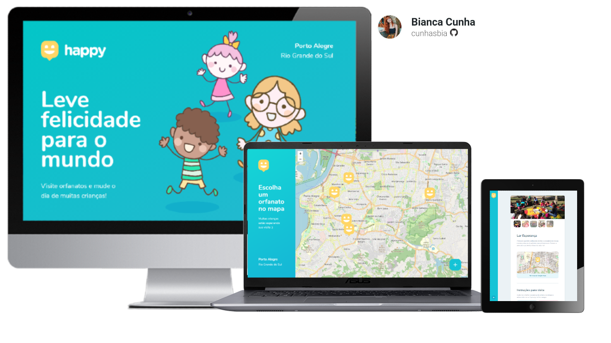

<h1 align="center">
    
</h1>

<p>Bring happiness to the world! The web application <strong>Happy</strong> mission is to assist underprivileged children, facilitating the search for nearby orphanages, registration of new homes and mainly take volunteers to change the day of these children.</p>
<p>Project developed during the Next Level Week #3 - Discovery trail - offered by Rocketseat.</p>

<p align="center">
    
</p>

## Technologies and tools used:

- HTML<br>
- CSS<br>
- Javascript<br>
- Nodejs<br>
- Express<br>
- Handlebars<br>
- SQLite<br>
- Git bash
<hr>

## How to run the project?

Before start the project, install [Git](https://git-scm.com) and [Node.js](https://nodejs.org/en/) in your machine.
Moreover, recommend use the [VSCode](https://code.visualstudio.com/) terminal.

```bash
# Clone this repository
$ git clone https://github.com/cunhasbia/nlw3-happy

# Access the repository on your terminal. Example:
$ cd /nlw3-happy

# Install dependencies
$ npm install

# Run
$ npm start

# Access http://localhost:5500 on your browser
```
<hr>
Made with 💜 by Bianca Cunha & Rocketseat
